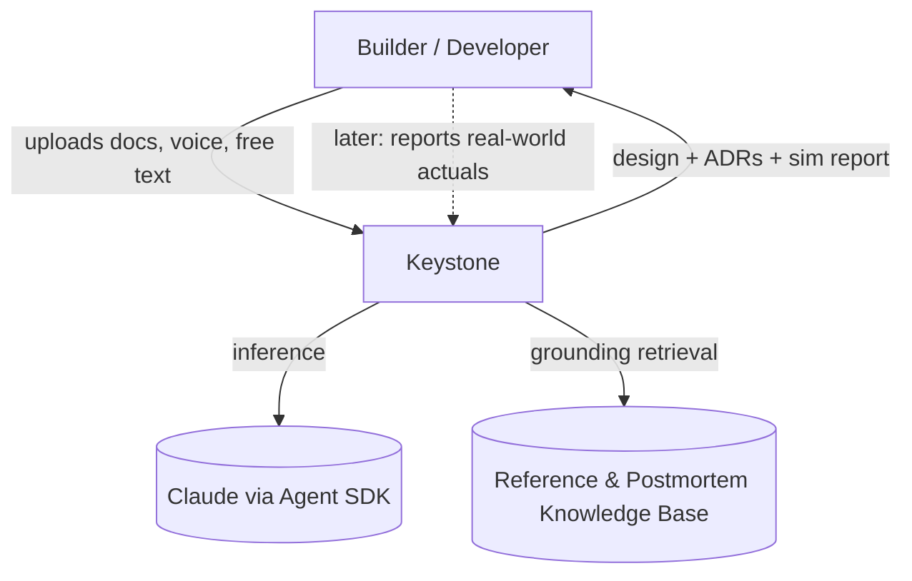
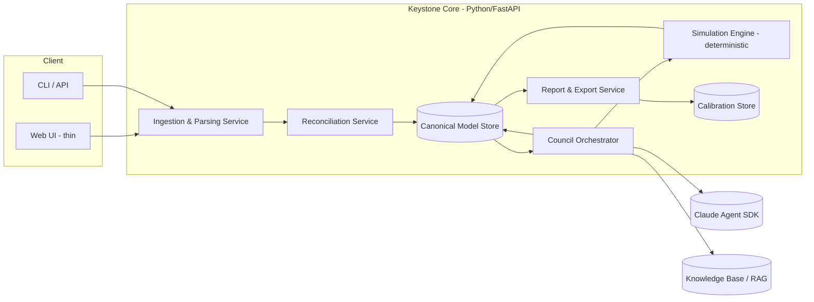

# Keystone — System Architecture

**Doc:** 02 · **Status:** Draft v0.1 · **Date:** 13 June 2026
**Playbook:** Pillar B (`ARC-B*`), Pillar H (`SEC-H*`), Overlay G (LLM product). Tier-1 from first external traffic (see Doc 00).
**Provenance:** `ASSUMPTION` throughout — nothing is built. Stack choices are recommendations, each with an alternative, to be ratified before code.

---

## 1. Architectural principle (the one that governs all others)

**The LLM reasons; the deterministic engine computes.** Claude designs, reconciles, advises, and critiques. A separate, deterministic simulation/analysis engine produces every number. They meet only at a typed boundary: the LLM *parameterises* the model; it never emits a metric. This separation is what makes the product trustworthy and is non-negotiable (`NFR-3`).

## 2. C4 Level-1 (context)

## 3. C4 Level-2 (containers)

## 4. Components

- **Ingestion & Parsing (`ING`).** Accepts multiple files (PDF/DOCX/MD/TXT), voice (→ transcript), pasted diagrams (Mermaid), and free text. One Claude pass per source extracts a partial system model + a record of every assumption made. Files are virus/secret-scanned on intake (harm floor).
- **Reconciliation (`REC`).** Merges partial models from N documents into one canonical model; **emits a conflict/gap report** rather than silently resolving contradictions (`FR-2`).
- **Canonical Model Store (`CM`).** The single source of truth (Doc 05). Versioned, diff-able, exportable as the design-as-code spec file. Postgres + object storage for large artifacts.
- **Council Orchestrator (`COU`).** Runs the three-stage consensus — *independent design → blind peer review → chairman synthesis* — across specialised personas (backend, data, security, SRE, cloud/FinOps, AI, YAGNI-skeptic). v1: **one model (Claude), multiple persona system-prompts** to control cost; multi-provider diversity is a v2 lever. Grounds each persona in the Knowledge Base. Emits ADRs with dissent + confidence + kill criteria.
- **Simulation Engine (`SIM`).** Deterministic. **v1 = analytical model** (queueing theory — Little's Law, M/M/c utilization, bottleneck propagation, seeded jitter), *not* a full discrete-event simulator. Returns metrics with confidence bands and the formula used. (Rationale: do not try to out-engineer SysSimulator's Rust/WASM DES in v1; an analytical model is enough to validate designs and is cheap to build. DES is a v2 upgrade.)
- **Knowledge Base / RAG (`KB`).** Curated corpus of reference architectures, component benchmarks, and incident postmortems. Grounds the council in evidence, not raw LLM priors — the difference between Keystone and a generic council.
- **Report & Export (`RPT`).** Diagram, spec file, ADR log, stress-test report, "needs-expert-review" flags, multi-cloud cost.
- **Calibration Store (`CAL`).** Records predictions and, later, user-reported actuals. The compounding moat; capture begins at launch even before the comparison UI exists.

## 5. Recommended stack *(each `SHOULD`, with alternative; ratify before code — `AIE-K7-01`)*

| Concern | Recommendation | Alternative |
|---|---|---|
| Core service | Python + FastAPI | Node/TypeScript |
| Council orchestration | Claude Agent SDK | Direct API + custom orchestrator |
| Simulation (v1) | Python analytical/queueing module | Rust DES (v2) |
| Canonical store | PostgreSQL (+ JSONB) | SQLite (Tier-0 prototype) |
| Uploads | Object storage (S3-compatible) | Local FS (prototype) |
| Web UI | Thin React/Next.js | Server-rendered, minimal JS |
| Grounding | pgvector over curated corpus | Hosted vector DB |
| Auth (when external) | Managed (Clerk/Auth0) | Self-hosted |

## 6. Security & tenancy (`SEC-H*`, Tier-1 obligations from day one)

- **Upload confidentiality `MUST`** — users' architecture docs are commercially sensitive; tenant-isolated storage, no cross-tenant retrieval, encryption at rest and in transit. Offer a local-first / no-retention mode (borrowed from SysSimulator's privacy positioning).
- **Harm floor `MUST`** — secret-scan uploads and the repo's full history; no committed credentials; no destructive op on a user's stored design without a recovery path.
- **Fail closed `MUST`** — if a confidentiality or integrity check can't be evaluated, deny.
- **Prompt-injection guardrail `MUST` (Overlay G)** — uploaded documents are untrusted input to the LLM; treat them as data, not instructions; strip/escape tool-trigger content.

## 7. Build-vs-buy

Buy: LLM (Claude), auth, object storage, vector store. Build: ingestion/reconciliation, the canonical model, the council orchestration logic, the simulation engine, calibration. **The build surface is exactly the moat surface.**

## 8. Known gaps (`GAP` — shortfall + fix)

- No DES engine in v1 → analytical model now; DES in v2 (`GAP`: fidelity ceiling on complex async topologies until then). **Reference design:** [Genesys-Simulator](https://github.com/rlcancian/Genesys-Simulator) is an open-source DES platform whose kernel (a chronologically-sorted future-event calendar + a step loop) is the concrete shape this deferred engine would take; it independently validates the same LLM-reasons/engine-computes boundary and is a cautionary tale on scope. Lessons (ADOPT-NOW / V2-REFERENCE / REFUSE) are mined and verified in `docs/13-Prior-Art-Genesys.md`.
- No eval harness yet for council output quality → Doc 03 defines it; build before external traffic (`GAP`).
- Knowledge Base unbuilt → curate a seed corpus before first real design (`GAP`).
